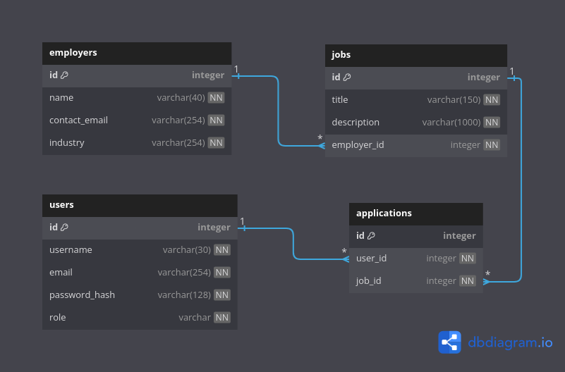

### GraphQL-job-board

A lightweight job board backend built with Strawberry, SQLAlchemy, FastAPI, and Postgres, exploring GraphQL best practices and efficient data loading.

#### 1. Summary

The main purpose of this project was to get familiar with GraphQL and Strawberry.
Main features:

- [Strawberry](https://strawberry.rocks/) : GraphQL library of choice for Python.
- SQLAlchemy: ORM for interacting with Postgres.
- FastAPI (default Uvicorn config): Exposes the GraphQL endpoint and injects request context.
- Postgres as the DB.
- Containerized the app, testing and databases with Docker.
- Used DataLoaders to avoid N+1 issues in nested queries.
- Basic role-based access control for queries, mutations and fields.
- JWT-based authentication.
- Tested with Pytest.

#### 2. Running the project

Ensure that the app folder contains two .env files: .env and .env.test. These should include the following variables (with sample values given):

```
POSTGRES_USER=myuser
POSTGRES_PASSWORD=mypassword
POSTGRES_DB=mydb
HOST=postgres_dev
PORT=5432
JWT_KEY="your_key_here"
JWT_ALGORITHM="HS256"
JWT_EXPIRATION_TIME_MINUTES=15
```

The values for `PORT` and `JWT_algorithm` should not be changed.

**Build the containers.**

```
docker compose up -d
```

**Access the GraphQL endpoint** at `http://localhost:8000/graphql`.
**Generating admin/user tokens**
Access the container's shell:

```
docker exec -it fastapi_app /bin/bash
```

From the project root, run:

```
conda activate strawberry_fast_api
python -m app.tests.utils
```

Alternatively, you can use the addUser and loginUser mutations to generate user tokens.
Include the token in the header of the requests, in this format:

```
{"Authorization": "Bearer token_goes_here"}
```

#### 3. Running the tests

```
docker exec -it test_runner conda run -n strawberry_fast_api pytest
```

#### 4. Project description

The app represents the backend of a basic job board. The relationships between entities can be visualized in the diagram below:


Each table has a corresponding SQLAlchemy DeclarativeBase class (e.g: Employer_sql), and a corresponding Strawberry type (e.g: Employer_gql).

**Cascade deletions:**

- Deleting an employer also deletes their jobs and all applications associated with those jobs.
- Deleting a user or a job deletes all related applications.

The queries and mutations supported by the app can be seen in [schema.graphql](./schema.graphql); in summary:

- CRUD operations for the Job and Employer entities.
- CR operations for the Users and Applications entities.
- A user can create a User entity with the `addUser` mutation then get a JWT with `loginUser`.
- A user can create an Application for a Job they haven't previously applied to.

Implemented basic role-based authorization with three roles:

- Unauthenticated (N): Access to jobs and employers queries, and to the addUser, loginUser mutations.
- User (U): Can access their own details and applications.
- Admin (A): Can add other admins, and manage jobs and employers.

Permissions for each query/mutation are summarized below:

| **Endpoint**   | **Permissions** |
| -------------- | --------------- |
| `applications` | U, A            |
| `employers`    | U, A, N         |
| `employer`     | U, A, N         |
| `job`          | U, A, N         |
| `jobs`         | U, A, N         |
| `users`        | U, A            |
| `loginUser`    | N               |
| `addUser`      | N, A            |
| `applyToJob`   | U               |

\*Only the admin role can perform mutations on jobs, employers.

\*Field resolvers for `Users` and `Applications` are also restricted based on role.

##### 5. Nested Queries

One way to avoid the N+1 problem in nested queries is to use DataLoaders, which batch and cache resource requests in order to minimize database hits ([documentation](https://strawberry.rocks/docs/guides/dataloaders#importing-data-into-cache)). These were implemented in the field resolvers of the Strawberry types.

To check whether I used them correctly, I enabled logging when creating the SQLAlchemy engine (`engine=create_engine(DATABASE_URL, echo=True)`) and observed no additional DB hits for the following query:

```
query {
  employers {
    jobs {
      employer {
        jobs {
          employer {
            jobs {
              employer {
                jobs {
                  id
                }
              }
            }
          }
        }
      }
    }
  }
}
```

From this, I can optimistically say that they do work as expected. From what I could find online, SQLAlchemy does not cache query results by default.

Restricting the max depth is recommended in order to prevent overly complex and potentially malicious queries ([OWASP](https://cheatsheetseries.owasp.org/cheatsheets/GraphQL_Cheat_Sheet.html#query-limiting-depth-amount)). It can be trivially implemented with the [QueryDepthLimiter](https://strawberry.rocks/docs/extensions/query-depth-limiter) extension. For this project, I set a depth limit of 5, as deeper queries seem unnecessary.

#### 6. Testing

Test fixtures are set in app.tests.conftest.py, following this extremely well-written [blog post](https://pytest-with-eric.com/api-testing/pytest-api-testing-2/)
The tables with the test data are re-created before every test, then tore down to ensure isolation. Achieved 96% test coverage.

#### 7. Project structure

- [auth](./app/auth): Defines roles, utility functions for password hashing/verifying, JWT generation, and an access-checking decorator.
- [db](./app/db): Contains the SQLAlchemy models and repository classes that contain the db operations required by the mutations/queries (maybe a bit boilerplate-y).
- [errors](./app/errors): Custom errors classes and strings for easier testing.
- [gql](./app/gql): Contains the Strawberry types, queries and mutations.
- [settings](./app/settings): Responsible for loading in the env variables.
- [tests](./app/tests): Contains tests, fixtures, and utility functions.

#### 8. Reflections, misc. thoughts

- Testing nested GraphQL queries turned out to be much more time-consuming than expected.
- Strawberry still seems to lack a query complexity/cost analysis tool, which is another recommended security feature by [OWASP](https://cheatsheetseries.owasp.org/cheatsheets/GraphQL_Cheat_Sheet.html#query-cost-analysis).
- Strawberry seems to have an excellent integration with Django's ORM but not with SQLAlchemy. In practice, this led to a few annoying and re-occurring circular reference errors when converting the SQLA objects to Strawberry types. It also resulted in two tightly-coupled classes representing the same entity, with the same fields, although in different contexts. I think this can be avoided by using the **[strawberry-sqlalchemy](https://github.com/strawberry-graphql/strawberry-sqlalchemy)** package, but I also wanted authorization for my field resolvers and I am unsure whether it supports that.
- I should have found a way to generalise the dataloaders, since most of them essentially perform the same operations.
- Wasted a lot of time trying to reinvent dataloaders (should have read the docs more carefully). My initial approach to handling nested queries was to limit their depth to 2 and then fetch data in bulk with explicit joins. In order to decide which join to perform (if any), I had to parse the request. For handling arbitrary query depth, I would have needed to do this recursively. This sounded overly complicated for such a simple use case, so I dove deeper and discovered the correct way to do this (using dataloaders).

#### 9. Additional references

Managing context with Strawberry: [link](https://www.ricdelgado.com/articles/17-building-fastapi-strawberry-nextjs-rsc-pt3/).

Used this old [Graphene-based course](https://www.udemy.com/course/building-graphql-apis-with-python/#overview) as a starting point for the project, taking inspiration from the DB schema, password hashing, and JWT generation.
